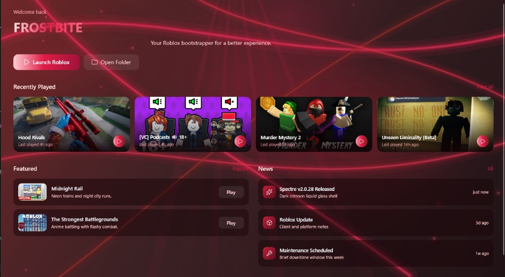

<p align="center">
  
</p>

<p align="center">
  <a href="https://github.com/lec1e/Spectre/releases/latest">
    
  </a>
  <a href="https://github.com/lec1e/Spectre/releases/latest">
    
  </a>
</p>

<p align="center">
  <strong>Spectre</strong> is a Froststrap-based Roblox launcher —
  Versions Manager, LIVE channel lock, BanAsync, multi-instance, and a dark crimson liquid-glass shell.
</p>

<p align="center">
  
</p>

## What’s new vs stock Froststrap

- **Versions Manager** — one profile per executor (WEAO / manual hash), dropdown to switch, optional picker on launch
- **LIVE channel lock** — Player launches forced to production (toggleable)
- **Spectre themes** — dark crimson liquid-glass shell, cursor-following rays, 30+ color presets
- **BanAsync** (Windows) — clean Roblox traces, MAC / MachineGuid helpers
- **Multi-instance + window tiling**
- **VIP / Server Browser / News** tabs
- **Privacy mode** — truncate `RobloxCookies.dat` before launch
- **Stream mode** — hide account-identifying UI while streaming

C# namespaces remain `Froststrap.*` and the assembly name stays `Eclipse` so existing installs keep working. The product name, logo, and UI branding are **Spectre**.

## Download

Grab the latest **Eclipse.exe** from [Releases](https://github.com/lec1e/Spectre/releases/latest).  
Auto-update picks up new stable releases when update checks are enabled.

## Build

```bash
# dependencies (if not already present)
git clone --depth 1 https://github.com/Froststrap/FluentAvalonia.git FluentAvalonia
git clone --depth 1 https://github.com/Froststrap/LucideAvalonia.git LucideAvalonia
git clone --depth 1 https://github.com/Froststrap/ColorPicker.git ColorPicker

dotnet build Froststrap/Froststrap.csproj -c Release
```

## License

Same multi-license model as Froststrap (AGPL-3.0 for Spectre modifications; MIT for upstream Bloxstrap/Fishstrap code).
MrExLive / ExploitStrap ports inherit MIT from that fork.
